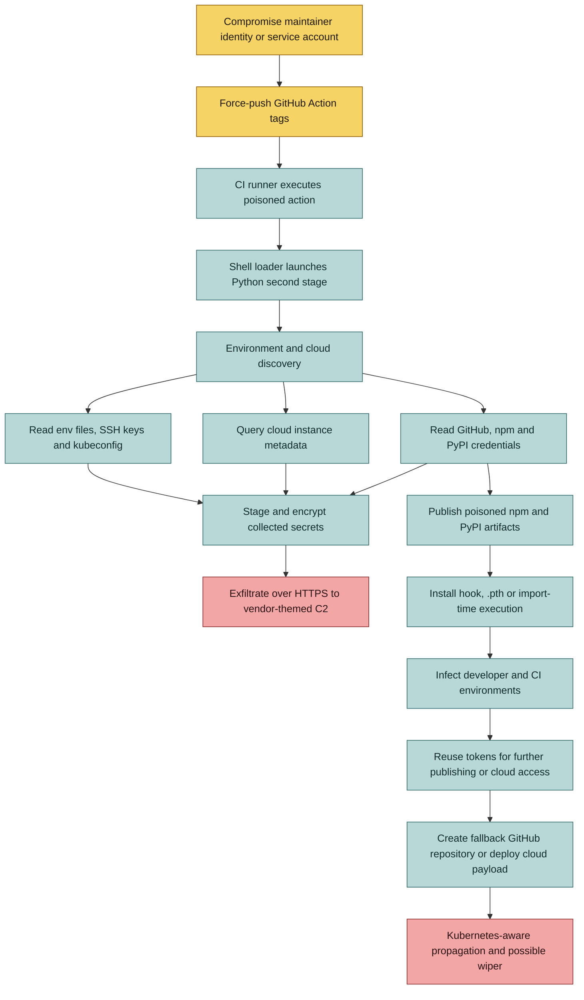

## TeamPCP

Most supply-chain conversations begin with a package: a dependency that nobody remembers adding, a maintainer account that gets phished, a release that quietly changes what downstream users install. That picture is still accurate. It is also incomplete. Modern software is assembled by an entire chain of automated systems: GitHub Actions, package registries, container builders, vulnerability scanners and cloud runners. Each one is trusted to execute code. Each one may also sit close to credentials that are worth far more than the code being built.

Security tooling is especially attractive in that model. It is deployed widely, runs automatically and is often granted access to repositories, cloud metadata or deployment context so it can do its job. The assumption is that a scanner only observes the environment. A compromised scanner can instead turn that visibility into a credential-harvesting capability without immediately breaking the workflow that defenders rely on.

That is what makes the recent TeamPCP activity worth looking at closely. This was not one malicious package turning up in an unfamiliar project. It was a sequence of compromises moving through trusted developer and security infrastructure, with each stage providing the access needed for the next.

[Unit 42's report](https://unit42.paloaltonetworks.com/teampcp-supply-chain-attacks/) describes a series of TeamPCP compromises that escalated between late February and late March 2026. The targets were not obscure utilities. They included Trivy and KICS GitHub Actions, LiteLLM on PyPI, and the Telnyx Python SDK.

The March supply-chain wave appears to have been disrupted, but it is too early to call the threat finished. Two alleged TeamPCP operators were arrested in Australia in August, while later tracking continued to describe the group as an active cloud and supply-chain actor. Arrests can interrupt access and infrastructure without invalidating credentials already stolen or removing packages and workflows that were compromised before the disruption. The practical conclusion is narrower: the documented March campaign was disrupted, not conclusively ended.

The sequence is the part I keep coming back to. TeamPCP did not need to compromise every downstream organization directly. It reached maintainer infrastructure first, then used the credentials exposed there to move into the next layer of the software ecosystem. A security scanner became a credential collection point. A stolen publishing token became a distribution mechanism. A package manager became the delivery channel.

That is a much more serious failure mode than a malicious dependency in a single application. The compromised tools were already present in build systems, security pipelines and cloud environments where credentials are expected to exist.

## The Attack Path

The first reported wave involved the Aqua Security Trivy repositories. TeamPCP used a compromised service account to force-push altered code to version tags in `aquasecurity/trivy-action` and `aquasecurity/setup-trivy`. The action still allowed the expected scan to complete, which is important operationally: a green security job is a powerful way to hide an attack.

The loader changed quickly. An initial shell script gave way to a smaller loader that retrieved a second-stage Python payload. That made the payload easier to change without rewriting the poisoned tags. The code collected cloud credentials, SSH material and Kubernetes data, and attempted to read credentials exposed through cloud instance metadata services.

The next step was reuse. Harvested GitHub and npm credentials were used to publish malicious versions of additional packages. The payload was inserted into npm lifecycle hooks, so installation on a developer workstation or CI runner was enough to trigger execution. The choice of SDK-like packages was deliberate: internal billing, insurance and accounting libraries are less likely to attract the scrutiny applied to an obvious security tool, while still reaching valuable corporate environments.

Checkmarx KICS followed on March 21. The attackers force-pushed tags in the KICS GitHub Action and poisoned a version of the Checkmarx action, replacing the normal entrypoint with another multi-stage stealer. When its primary collection path was unavailable, the malware reportedly used a hidden repository created with the victim's `GITHUB_TOKEN` as a fallback channel.

LiteLLM was a different distribution surface. Malicious versions 1.82.7 and 1.82.8 were uploaded to PyPI. The latter used a `.pth` file, which Python processes can load during interpreter startup. That meant execution did not depend on an application importing LiteLLM. It depended on Python starting in an environment where the package had been installed.

The campaign then reached the Telnyx SDK, where malicious package versions executed at import time. The reported use of encrypted second stages hidden in valid audio files is a reminder that payload delivery does not have to look like a binary download to be effective.

## The TTPs

The campaign can be mapped to a small set of recurring techniques. This is an analytical mapping to the observed behavior, not an official TeamPCP technique list:

These techniques are easier to understand as a progression than as an inventory. The first stage changes what a trusted system publishes. The second stage gets that altered code executed in a runner that already has network access and may hold temporary or persistent credentials. The third stage turns that execution into discovery and collection. Only after those permissions have been harvested does the operation become a broader supply-chain campaign, with new packages and actions carrying the same behavior into additional environments.

That ordering matters for defenders. The GitHub tag rewrite, the npm install hook and the Python `.pth` file are different delivery mechanisms, but they solve the same problem: getting code to run inside an environment that developers already consider legitimate. The payloads then converge on the same objectives: identify high-value secrets, stage them locally, exfiltrate them and reuse the resulting tokens for further publishing or cloud access. The attack path and TTPs below describe that progression.

- **T1195.002, Compromise Software Supply Chain:** trusted repositories, release tags and package registries were used as the initial distribution layer.
- **T1608.001, Upload Malware:** malicious GitHub Action revisions and package releases were published through legitimate maintainer or publishing paths.
- **T1552.001, Credentials In Files:** the payload searched `.env` files, cloud configuration directories, SSH keys and Kubernetes configuration.
- **T1552.005, Cloud Instance Metadata API:** cloud runner and workload metadata endpoints were queried for temporary credentials.
- **T1059.004 and T1059.006, Unix Shell and Python:** shell loaders and Python second stages provided a portable execution path across runners and cloud hosts.
- **T1027, Obfuscated Files or Information:** staged payloads, double Base64 encoding and encrypted archives increased the cost of static inspection.
- **T1071.001, Web Protocols:** HTTPS-like web requests and vendor-themed typosquat domains provided the application-layer channel used for command and control or data transfer.
- **T1041, Exfiltration Over C2 Channel:** collected secrets were sent through the actor's command-and-control infrastructure after local staging.
- **T1074.001, Local Data Staging:** collected secrets were written into intermediate files before encryption and transmission.
- **T1543.002, Systemd Service:** later payloads established Linux persistence while presenting themselves as ordinary system services.
- **T1610, Deploy Container:** CanisterWorm used Kubernetes-aware propagation and privileged cluster workloads. This describes container deployment and potential cluster impact; it does not, by itself, prove lateral movement.

There is no single clever trick holding this together. The leverage comes from privilege alignment. The action already had access to the token. The runner already had network access. The scanner already ran close to infrastructure secrets. TeamPCP mostly had to make those permissions serve a different purpose.

## What the Telemetry Looks Like

The most useful detections are behavioral rather than package-name based. A Python process in a CI runner reading Kubernetes secrets, querying cloud metadata and launching `curl`, `openssl` or `systemctl` deserves investigation. So does a security action that creates a repository, changes its own tags, or makes outbound requests to a domain that resembles its vendor but is not owned by the vendor.

The reported artifacts include `kamikaze.sh`, `kube.py`, `prop.py`, `proxy_server.py` and `tpcp.tar.gz`. The infrastructure included domains such as `scan.aquasecurtiy[.]org`, `checkmarx[.]zone` and `models.litellm[.]cloud`. These indicators will age quickly. Process ancestry, runner identity, package provenance and token-use history will age more slowly.

There is also a subtle detection problem here. If the malicious step runs before the legitimate scanner and the scanner still exits successfully, monitoring only job status misses the compromise. CI logs need to be treated as security telemetry, not just build output. Network egress from runners needs the same attention.

## The Part That Still Surprises Me

We have spent years telling developers to use security tooling earlier in the lifecycle. That advice is correct, but it creates a concentration problem. Security tools are installed broadly, run automatically and granted access to the exact secrets that ordinary build steps should not need.

The answer is not to stop using scanners or package registries. It is to stop treating a trusted name as an authorization boundary. Pin actions to immutable commit SHAs. Review tag movement as a security event. Separate scan credentials from deployment credentials. Give runners short-lived, scoped identities and deny them access to instance metadata unless the job explicitly requires it. Verify package provenance before execution, including transitive dependencies and install hooks.

An SBOM helps answer what should be present. It does not, by itself, tell you whether the thing that ran was the thing you approved. That requires lockfiles, artifact attestations, registry history, workflow review and runtime telemetry working together.

## The Real Lesson

The TeamPCP campaign was technically ambitious, but its leverage came from ordinary assumptions: tags are stable, actions are benign, install hooks are harmless, CI secrets are temporary and a successful security scan is evidence of safety.

None of those assumptions survives contact with a compromised maintainer account.

The most uncomfortable conclusion is also the most actionable one. Supply-chain security is not mainly a cataloging problem. It is an identity and execution problem. We need to know who can publish, which exact workflow will execute, what that workflow can read, and whether its behavior still matches its stated purpose.

*Transparency: Edited and proofread with assistance from GitHub Copilot, using GPT 5.6 Luna. Keep using your brain.*

